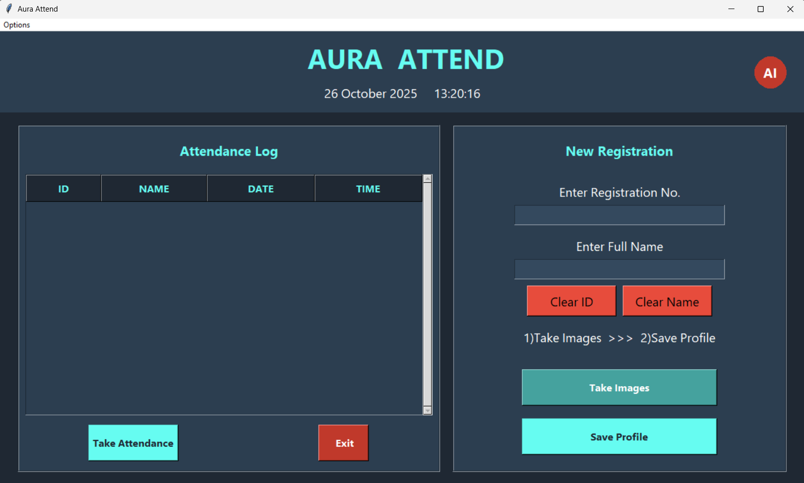

# 🔮 AURA ATTEND - AI-Powered User Recognition for Attendance

<div align="center">


*A smart, contactless desktop application that automates attendance using facial recognition and provides instant insights with a conversational AI.*

</div>

## 📸 Screenshot

Here is a preview of the application's user interface:

 


## 📋 Table of Contents

- [🎯 Project Overview](#-project-overview)
- [✨ Features](#-features)
- [🛠️ Technologies Used](#️-technologies-used)
- [🤖 AI & Vision Models](#-ai--vision-models)
- [🚀 Quick Start](#-quick-start)
- [🔄 Usage](#-usage)
- [📈 Project Structure](#-project-structure)
- [🎨 UI Features](#-ui-features)
- [🤝 Contributing](#-contributing)
- [📄 License](#-license)

## 🎯 Project Overview

**AURA Attend** is an intelligent desktop application designed to modernize and automate the process of attendance tracking. It addresses the inefficiencies and inaccuracies of traditional methods by leveraging a powerful combination of computer vision and conversational AI. The system provides two core functionalities:

1.  **Automated Attendance Tracking**: Securely marks attendance in real-time using facial recognition, eliminating manual errors and proxy attendance.
2.  **Conversational Data Analysis**: An integrated AI assistant, powered by Google Gemini, allows users to ask questions about attendance data in plain English and receive instant answers.

The application features a modern, professional, and user-friendly dark-themed interface built with Tkinter, making it a perfect tool for educational institutions, corporate offices, and event management.

## ✨ Features

### 🎨 Modern User Interface
-   **Professional Dark Theme**: A visually appealing and easy-to-read interface suitable for any environment.
-   **Dashboard Layout**: Cleanly organized with a registration panel on one side and a real-time attendance log on the other.
-   **Live Clock & Date**: Displays the current time and date for user convenience.
-   **Status Feedback**: Provides real-time messages to guide the user through the registration and attendance process.
-   **Password Protection**: Secures the model training process with an administrator password.

### 🤖 AI-Powered Recognition & Analysis
-   **Real-Time Face Detection**: Utilizes Haar Cascades for fast and efficient detection of faces from a live webcam feed.
-   **Accurate Face Recognition**: Employs the LBPH algorithm, which is robust against changes in lighting, to accurately identify registered users.
-   **Conversational AI Assistant**:
    -   Powered by Google Gemini for intelligent responses.
    -   Accepts both **voice** and **text** commands.
    -   Answers questions about real-time and historical attendance data (e.g., "How many people are absent today?").

### ⚡ Performance & Convenience
-   **Responsive Interface**: Uses threading for camera operations to ensure the GUI never freezes.
-   **Organized Data Logging**: Automatically saves attendance records into daily CSV files.
-   **Easy User Management**: Simple interface for registering new users and capturing their facial data.
-   **Cross-Platform**: Built with Python and Tkinter, it can run on Windows, macOS, and Linux.

## 🛠️ Technologies Used

| Technology | Purpose |
|------------|---------|
|  | Core programming language |
|  | Native GUI toolkit for the desktop application |
|  | For all computer vision tasks (detection & recognition) |
|  | For efficient data handling and analysis of CSV files |
|  | For numerical operations and image array manipulation |
|  | For opening and processing image files |
|  | For the conversational AI assistant API |
| **SpeechRecognition** | For converting user voice commands to text |
| **pyttsx3** | For providing text-to-speech voice output |

## 🤖 AI & Vision Models

### Haar Cascade Classifier
-   **Developers**: Paul Viola and Michael Jones
-   **Model**: `haarcascade_frontalface_default.xml`
-   **Purpose**: **Face Detection** (finding the location of a face).
-   **Strengths**: Extremely fast, lightweight, and highly effective for real-time detection on standard CPUs.

### Local Binary Patterns Histograms (LBPH)
-   **Developers**: Ojala, Pietikäinen, & Mäenpää
-   **Purpose**: **Face Recognition** (identifying who the face belongs to).
-   **Strengths**: Robust against variations in lighting, computationally efficient (runs on CPU), and simple to train.

### Google Gemini
-   **Developer**: Google
-   **Purpose**: **Conversational AI** and general knowledge queries.
-   **Strengths**: Powerful natural language understanding, versatile, and can answer questions beyond the scope of the local attendance data.

## 🚀 Quick Start

### Prerequisites
- Python 3.8 or higher
- A webcam and microphone
- Google Gemini API key
- C++ Build Tools (may be required for a `pyttsx3` dependency on Windows)

### Installation

1.  **Clone the repository**
    ```bash
    git clone https://github.com/yourusername/aura-attend.git
    cd aura-attend
    ```

2.  **Create a virtual environment**
    ```bash
    # Windows
    python -m venv venv
    venv\Scripts\activate

    # macOS/Linux
    python3 -m venv venv
    source venv/bin/activate
    ```

3.  **Install dependencies**
    ```bash
    pip install -r requirements.txt
    ```
    *(You will need to create a `requirements.txt` file containing all the necessary libraries like `opencv-python`, `pandas`, `numpy`, etc.)*

4.  **Set up API key**
    
    Create a `.env` file in the project root and add your API key:
    ```env
    GEMINI_API_KEY=your_google_gemini_api_key_here
    ```
    Then, modify the code to load this key instead of hardcoding it.

5.  **Download Haar Cascade File**
    
    Ensure the `haarcascade_frontalface_default.xml` file is in the root directory of the project.

6.  **Launch the application**
    ```bash
    python main.py
    ```

## 🔄 Usage

Once the application is running, follow these steps:

**1. Register a New User**
-   Navigate to the "New Registration" panel on the right.
-   Enter a unique "Registration No." (ID) and the "Full Name" of the person.
-   Click the **Take Images** button. A window will appear to capture 100 facial samples.

**2. Train the Model**
-   After registering one or more new users, click the **Save Profile** button.
-   You will be prompted to enter the administrator password. On the first run, you will set a new password.
-   The system will train the LBPH model on the new images and save it.

**3. Take Attendance**
-   Click the **Take Attendance** button on the left panel.
-   A window will appear showing the live camera feed.
-   When a registered person is recognized, their name will be displayed on the screen, and their attendance will be logged in the Treeview and saved to a CSV file.

**4. Use the AI Assistant**
-   Click the circular "AI" button in the header.
-   A new window will open. You can either type your question or click "Listen" to ask a question using your voice (e.g., "How many students are absent today?").

## 📈 Project Structure

```
AURA ATTEND/
│
├── Attendance/
│   └── Attendance_DD-MM-YYYY.csv   # Daily attendance logs are stored here
│
├── Data/                           # (This folder seems unused in your final code)
│
├── StudentDetails/
│   └── StudentDetails.csv          # Master list of all registered users
│
├── TrainingImage/
│   └── User.ID.Name.Sample.jpg     # All captured facial images are stored here
│
├── TrainingImageLabel/
│   ├── psd.txt                     # Stores the encrypted administrator password
│   └── Trainner.yml                # The trained LBPH face recognition model
│
├── main.py                         # The main entry point of the application
├── haarcascascade_frontalface_default.xml # Pre-trained model for face detection
├── README.md                       # Project documentation (this file)
└── requirements.txt                # List of Python dependencies (you need to create this)
```

## 🎨 UI Features

### Header Section
-   **Bold Branding**: Large "AURA ATTEND" title.
-   **AI Assistant Button**: A prominent circular button to launch the conversational AI.
-   **Live Clock & Date**: Real-time display for user reference.

### Main Content Area
-   **Two-Column Layout**: A clean separation between the attendance log (left) and user management (right).
-   **Attendance Log Panel**:
    -   Uses a `ttk.Treeview` to display a clean, real-time list of all marked attendance for the day.
    -   Includes columns for ID, Name, Date, and Time.
-   **Registration Panel**:
    -   Clear input fields for new user ID and Name.
    -   Action buttons ("Take Images", "Save Profile") for the registration workflow.
    -   A status message label to provide feedback to the user.

### AI Assistant Window
-   **Conversational Interface**: A chat-style window to show the history of questions and answers.
-   **Multi-Modal Input**: Supports both text entry and voice commands via a "Listen" button.
-   **Status Indicator**: Shows the assistant's current status (e.g., "Ready", "Listening...", "Thinking...").

## 🤝 Contributing

Contributions are welcome! If you have ideas on how to improve this project:

1.  🍴 Fork the repository
2.  🌿 Create a feature branch (`git checkout -b feature/NewFeature`)
3.  💾 Commit your changes (`git commit -m 'Add some NewFeature'`)
4.  📤 Push to the branch (`git push origin feature/NewFeature`)
5.  🔄 Open a Pull Request

### Ideas for Contributions:
-   🌙 Add a dark/light mode toggle.
-   🧠 Upgrade the LBPH model to a **Deep Learning model (like FaceNet or ArcFace)** for higher accuracy.
-   👁️ Implement **Liveness Detection** to prevent spoofing with photos.
-   ☁️ Migrate data storage from CSV files to a **cloud database (like Firebase or a SQL server)**.
-   🌐 Develop a **web-based version** of the application using a framework like Flask or FastAPI.
-   📊 Add a "Reports" section to the GUI to visualize attendance data with charts and graphs.

## 📄 License

This project is licensed under the MIT License - see the `LICENSE` file for details.

---

<div align="center">

### 🌟 If you found this project helpful, please give it a star! ⭐

**Created with ❤️ by Jeev | Powered by AI**

</div>
